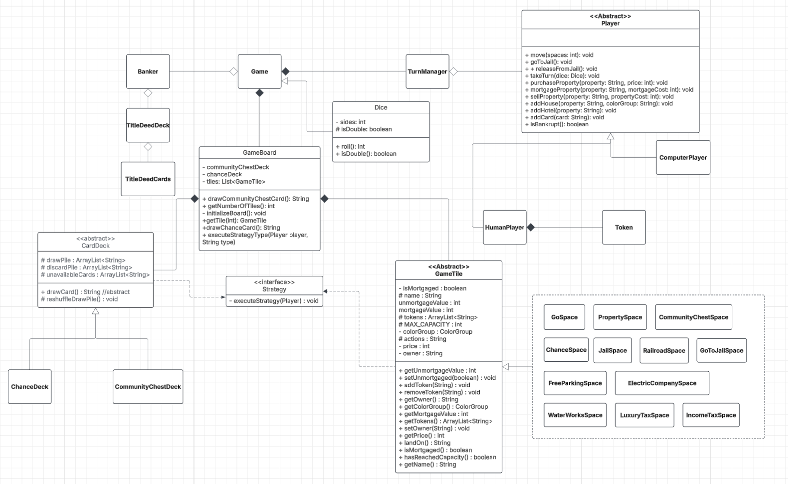
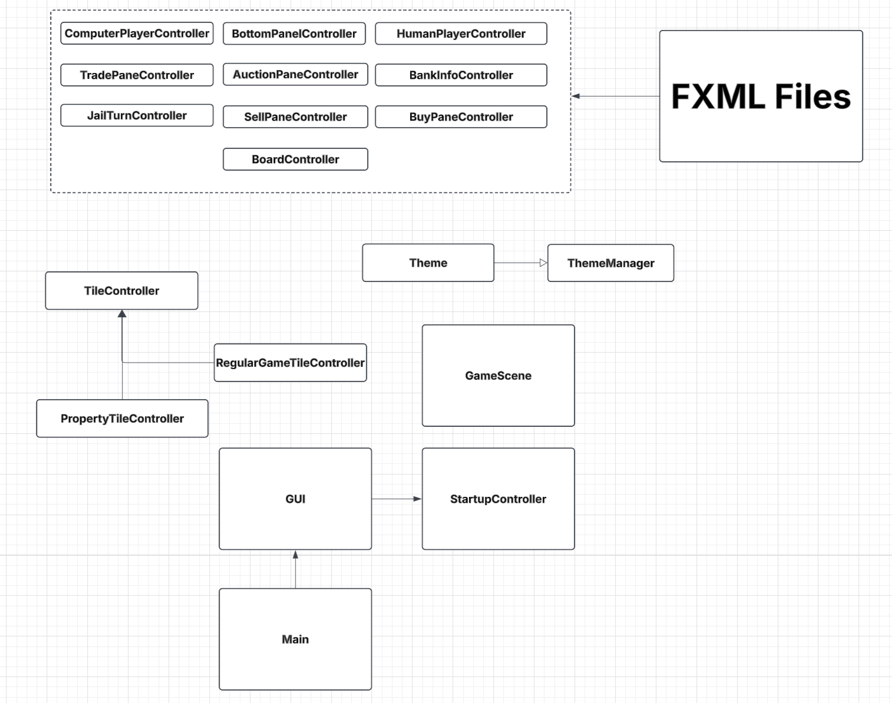

# Monopoly Game Project
## CI Status:

### Developers
1. Jonathan Walsh
2. Sydney Shifman
3. Sean Creveling

### Project Description
The Monopoly Game Project is a JavaFX-based implementation of the classic board game Monopoly. The project aims 
to create a digital version of the game that allows users to play against the computer. 
The game includes features such as buying and selling properties, collecting rent, and drawing chance and 
community chest cards.

### Installing Code
To install the code, follow these steps:

1. Clone the repository from GitHub using: git clone https://github.com/your-username/monopoly-game-project.git
2. Navigate to the project directory using the command: cd MonopolyProject, or open the project in your IDE
3. Build the project using the command: mvn clean package
4. The project is now installed and ready to run.

### Steps to run through IDE
1. Go through the project directory (src/main/java/org/monopoly/View/Main.java) and run the Main class.
2. If project is not running, and gives SDK error, go to File > Project Structure > Project > SDK > then select an **SDK 22** or higher.

### Steps to run through as a stand-alone program.
1. Clone the repository to your desired place of storage.
2. Open your terminal at the file location where the repository was cloned.
3. Run the following command to build the project: `mvn clean javafx:jlink`
4. Run the following command to launch the application: `target/MonopolyGameRuntime/bin/MonopolyGame`

### Design Patterns Used:
- Singleton: Used for Banker, Dice, GameScene, GUI, TurnManager, and TitleDeedCards
- Strategy: Used for all GameTiles as well as all Decks (chance and community chest)
- Observer: Between Players and their respective interfaces, as well as tiles and the tokens displayed on them.

### Working parts of code:
- Start menu allows for users to select their token, the number of human/computer players, and has validation for repeat name/token usage
- Players turn process works completely, and both human and computer players are able to:
   - Move
   - Roll doubles
   - Draw cards
   - Buy properties
   - Trade Properties
   - Go to Jail
   - Get out of jail (use funds, get out of jail free card, or roll for doubles)
- The board displays where each player is, moves their token when they move, and displays the accurate dice value rolled.
- The Player interfaces show the players current information including their properties, token, the buttons they are allowed to use, and their balance.
- Computer players turn is fully automated, and they make decisisons with weights based on their current balance.
- Alerts are sent out to display the current game event taking place
- Display the bankers current asset count
- Players can collectively decide to end the game.
- Players can individually quit the game (forfeit)

### Non-working features:
- Auction process does not interact with GUI as of now.
- Players are not currently able to purchase houses and hotels from the GUI
- Logic for players going bankrupt and thus losing the game.
- Computer player attempts to sell items if they run out of money
- Computer player completes their turn incredibly fast; sometimes messing with the end frame of the dice roll animation (like on several doubles)
- If there is a tie at the end of the game, the game currently just picks a random player from the tie.

### Project Purpose
The Monopoly Game Project is designed to provide a fun and interactive way to play the classic board game 
Monopoly. The game can be played by one user against the computer and has features like:

Buying and selling properties
Collecting rent
Drawing chance and community chest cards
Building houses and hotels

Note: This is a basic implementation of the game, and there may be some features that are not included. The project is intended to be a starting point for further development and customization.
As of right now, there is a User Interface implemented, but not completed.

### Main UML

### View UML

